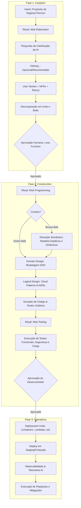

# Guia Metodológico Completo: AI-Driven Development Lifecycle (AI-DLC)

Baseado no artigo técnico de Raja SP (Amazon Web Services): *AI-Driven Development Lifecycle (AI-DLC) Method Definition*.

---

## 1. O Contexto e a Necessidade da Reimaginação

A evolução da engenharia de software sempre buscou abstrair tarefas de menor nível e indiferenciadas (da linguagem de máquina para compiladores, linguagens de alto nível, frameworks e APIs em nuvem).
- **Era AI-Assisted**: Uso pontual de Large Language Models para geração de código, detecção de bugs ou criação de testes pontuais dentro dos processos ágeis tradicionais (Scrum/Kanban). Nessa fase, os humanos ainda realizam a maior parte do trabalho intelectual e a IA apenas amplifica.
- **Era AI-Driven**: A IA assume o papel ativo de orquestração do ciclo de vida: elaboração de requisitos, decomposição de tarefas, planejamento de arquitetura, modelagem de domínio e execução em tempo real em simbiose com os desenvolvedores.

**Por que não retroajustar (retrofit) o Scrum/Kanban?**
Modelos tradicionais foram desenhados para iterações humanas de semanas ou meses, exigindo reuniões diárias (daily standups), estimativas por story points, cálculo de velocity e retrospectivas quinzenais. A IA reduz ciclos de desenvolvimento de semanas para **horas ou dias**. Estimativas manuais perdem o sentido diante da aceleração de tarefas médias e complexas. Portanto, é necessária uma abordagem nativa, com princípios e rituais próprios.

---

## 2. Os 10 Princípios Fundamentais do AI-DLC

| # | Princípio | Significado Prático |
|---|---|---|
| **1** | **Reimagine Rather than Retrofit** | Repensar o SDLC a partir dos primeiros princípios de IA, priorizando Entrega de Valor de Negócio em vez de métricas de esforço como story points. |
| **2** | **Reverse the Conversation Direction** | A IA propõe, decompõe e direciona os fluxos; os humanos atuam no papel de aprovação, ajuste e supervisão estratégica (analogia com GPS). |
| **3** | **Integration of Design Techniques into the Core** | Técnicas arquiteturais sólidas como Domain-Driven Design (DDD), BDD e TDD não são opcionais, mas sim partes intrínsecas da orquestração da IA. |
| **4** | **Align with AI Capability** | Reconhecer que a IA atual não opera com segurança 100% autônoma sem supervisão. O desenvolvedor mantém a responsabilidade final e julgamento crítico. |
| **5** | **Cater to Building Complex Systems** | O método foi concebido para cenários corporativos complexos, com trade-offs arquiteturais, requisitos não-funcionais (NFRs), governança e escalabilidade. |
| **6** | **Retain What Enhances Human Symbiosis** | Preservação de contratos humanos essenciais: User Stories como contratos formais e Risk Register para compliance. |
| **7** | **Facilitate Transition Through Familiarity** | Manutenção de correlação conceitual com termos conhecidos, com rebatismo intencional (ex.: Sprints transformam-se em **Bolts**). |
| **8** | **Streamline Responsibilities for Efficiency** | Redução de silos verticais de especialização (frontend, backend, infra, devops, segurança) em favor de desenvolvedores full-spectrum apoiados por IA e Product Owners. |
| **9** | **Minimise Stages, Maximise Flow** | Validação humana funciona como uma função de perda ("loss function"), cortando esforços downstream equivocados antes de gerarem desperdício de código rígido ("quick-cement"). |
| **10** | **No Hard-Wired, Opinionated SDLC Workflows** | A IA recomenda um plano flexível de Nível 1 baseado na intenção (Green-field, Brown-field, modernização, correção de bugs) e o decompõe interativamente. |

---

## 3. O Ciclo de Vida: Fases e Rituais

---

## 4. Diferenciação Chave: Green-field vs Brown-field

- **Green-field**:
  1. IA recebe o Intent e decompõe em Units e Bolts.
  2. Elabora Domain Design a partir de DDD puro.
  3. Mapeia para serviços de nuvem e padrões de tolerância/escalabilidade no Logical Design.
  4. Gera código e suíte de testes automatizados.
- **Brown-field**:
  1. A IA realiza primeiramente a **elevação semântica** do código existente.
  2. Cria **Modelos Estáticos** (componentes existentes, interfaces, dependências, responsabilidades).
  3. Cria **Modelos Dinâmicos** (como os componentes interagem para realizar os casos de uso críticos atuais).
  4. Validação humana do modelo reverso com PO e Desenvolvedor.
  5. Continua o fluxo idêntico ao Green-field para as novas funcionalidades ou refatorações.

---

## 5. Mapeamento do Workflow Oficial e Templates Vinculados (Ordem Cronológica)

O fluxo canônico do AI-DLC estabelece 9 etapas sequenciais e iterativas interligadas pela Context Memory (`spec-docs/`):

0. **Setup Inicial & Auditoria**: [`00_prompts_ledger_template.md`](templates/00_prompts_ledger_template.md)
1. **Build Context from Existing Codes** (Brown-Field): [`02_code_context_elevation_template.md`](templates/02_code_context_elevation_template.md)
2. **Elaborate Intent with User Stories** (Inception): 
   - Captura e clarificação do Intent: [`01_intent_template.md`](templates/01_intent_template.md)
   - Proposta de plano Level 1 com Loss Function: [`03_level_1_plan_template.md`](templates/03_level_1_plan_template.md)
   - Alinhamento executivo via Working Backwards: [`04_prfaq_template.md`](templates/04_prfaq_template.md)
   - Planejamento e redação de User Stories: [`05_user_stories_plan_template.md`](templates/05_user_stories_plan_template.md), [`06_user_stories_template.md`](templates/06_user_stories_template.md)
   - Requisitos Não-Funcionais e Riscos: [`07_nfr_definitions_template.md`](templates/07_nfr_definitions_template.md), [`08_risk_register_template.md`](templates/08_risk_register_template.md)
   - Critérios de medição de valor: [`09_measurement_criteria_template.md`](templates/09_measurement_criteria_template.md)
3. **Plan the Units of Work** (Inception): [`10_units_plan_template.md`](templates/10_units_plan_template.md), [`11_units_bolts_decomposition_template.md`](templates/11_units_bolts_decomposition_template.md)
4. **Model the Domain, Architecture & Specifications** (Construction): [`12_component_model_plan_template.md`](templates/12_component_model_plan_template.md), [`13_domain_design_template.md`](templates/13_domain_design_template.md), [`14_logical_design_adr_template.md`](templates/14_logical_design_adr_template.md)
5. **Solve for Non-Functional Requirements & Cloud Topology** (Construction): [`15_deployment_plan_template.md`](templates/15_deployment_plan_template.md)
6. **Define Test Strategy & Acceptance Matrix** (Construction): [`16_test_plan_and_validation_report_template.md`](templates/16_test_plan_and_validation_report_template.md)
7. **Package Deployment Units Specifications** (Construction/Packaging): [`17_deployment_units_template.md`](templates/17_deployment_units_template.md)
8. **Operations & Incident Playbooks** (Operations): [`18_observability_playbook_template.md`](templates/18_observability_playbook_template.md)

> *Nota de Fronteira*: A fase subsequente de implementação em código-fonte é executada por um agente de desenvolvimento (*Coding Agent*), consumindo o pacote SDD gerado (`spec.md`, `plan.md`, `tasks.md`). O AI-DLC Specialist atua na auditoria de convergência (`converge.md`) pós-desenvolvimento.

