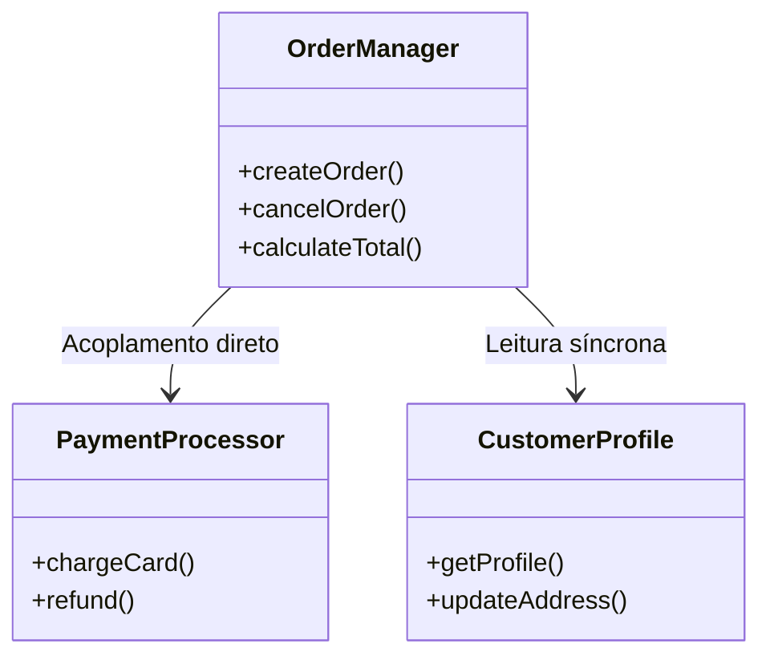
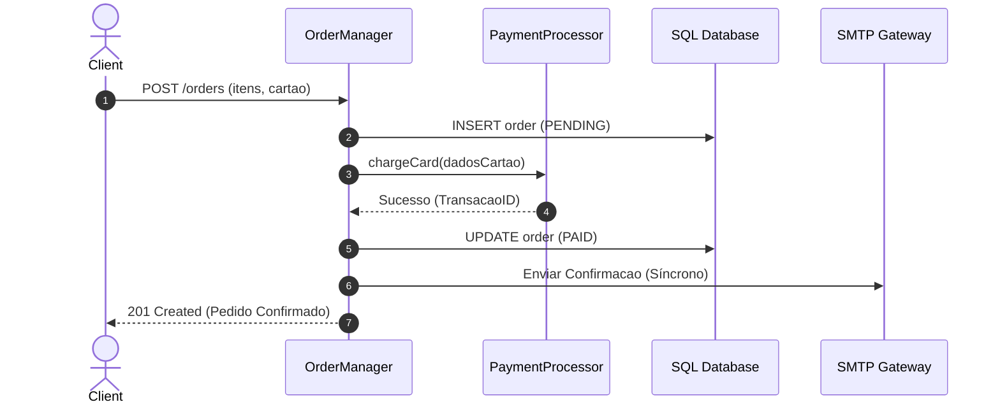

# Code Context Semantic Elevation (Brown-Field Reverse Engineering)

**Aplicação / Repositório Alvo**: [Nome do Sistema Existente]  
**Status**: [Draft / In Review / Validated]  
**Data da Análise**: [YYYY-MM-DD]  
**Engenheiro Responsável**: [Tech Lead / AI-DLC Specialist]  

---

## 1. Princípio da Elevação Semântica (Brown-Field)
Em cenários Brown-Field (sistemas existentes), a IA não deve gerar código ou alterações diretamente sobre o código legado sem antes **elevar o código existente para representações semânticas de alto nível**. Isso reduz o ruído de contexto, condensa a base de conhecimento e garante precisão cirúrgica para os novos Bolts.

---

## 2. Modelo Estático (Static Domain Model)
*Mapeamento dos componentes de domínio existentes, suas responsabilidades centrais e seus relacionamentos estruturais.*

### 2.1 Tabela de Componentes e Responsabilidades Existentes
| Componente / Módulo Legado | Caminho no Código | Responsabilidade de Domínio | Dependências Acopladas | Débito Técnico Observado |
|---|---|---|---|---|
| `PaymentProcessor` | `src/services/payment.py` | Orquestra autorização e liquidação com adquirentes | Banco relacional direto, SDK da operadora | Lógica de negócio misturada com chamadas HTTP |
| `OrderManager` | `src/models/order.py` | Gerencia ciclo de vida de pedidos e inventário | `PaymentProcessor`, `NotificationQueue` | God-class com mais de 2.000 linhas |
| `CustomerProfile` | `src/modules/customer/` | Manutenção de dados cadastrais e endereços | Nenhuma externa | Modelo relativamente limpo, mas sem imutabilidade |

### 2.2 Diagrama Estrutural dos Componentes

---

## 3. Modelo Dinâmico (Dynamic Interaction Model)
*Como os componentes legados interagem hoje para realizar os casos de uso críticos do sistema.*

### 3.1 Fluxo Atual de Caso de Uso Crítico: [ex.: Processar Pedido de Compra]

---

## 4. Pontos de Fricção e Oportunidades de Desacoplamento para o Novo Intent
- **Ponto 1**: O envio de e-mail síncrono trava a resposta ao usuário -> Desacoplar para mensageria assíncrona.
- **Ponto 2**: O `OrderManager` chama diretamente a API da adquirente -> Isolar em uma nova Unit com padrão Ports and Adapters (Arquitetura Hexagonal).

---

## 5. Checkpoint de Validação do Desenvolvedor e PO
- [ ] O modelo estático reflete com precisão as responsabilidades do código legado existente.
- [ ] O modelo dinâmico captura as dependências reais e efeitos colaterais em produção.
- [ ] O escopo de refatoração ou acréscimo do novo Intent foi delimitado sem quebrar fluxos legados.
