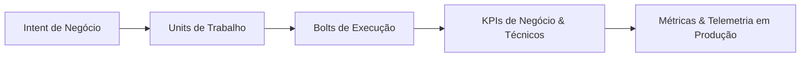

# Measurement Criteria (Business Value Tracing): [Nome da Iniciativa]

**Intent de Referência**: [Declaração do Intent]  
**Status**: [Ativo / Medido / Em Revisão]  
**Data**: [YYYY-MM-DD]  

---

## 1. Princípio do AI-DLC: Business Value em vez de Velocity
No AI-DLC, o esforço de estimativa tradicional (Story Points) e métricas de velocidade da equipe (Velocity) são substituídos pela **Mensuração Contínua de Valor de Negócio**. A eficiência de cada Unit e Bolt é avaliada pelo impacto real que entrega aos objetivos de negócio e aos usuários.

---

## 2. Mapa de Rastreabilidade (Traceability from Intent to Telemetry)

---

## 3. Matriz de Critérios de Medição e Indicadores de Sucesso

| Dimensão | Indicador Chave (KPI / OKR) | Linha de Base Atual (Baseline) | Meta Alvo (Target) | Fonte de Dados / Telemetria | Frequência de Medição |
|---|---|---|---|---|---|
| **Impacto no Negócio** | Taxa de conversão de compras recomendadas | 2.1% | 4.5% | Analytics / Checkout Event | Diária |
| **Eficiência de Receita** | Ticket médio gerado por cross-sell | R$ 45,00 | R$ 75,00 | Banco Transacional / Data Lake | Semanal |
| **Adoção do Usuário** | Usuários únicos interagindo com a feature | 0 | > 50.000 / mês | Métricas de Ingress / API Gateway | Diária |
| **Eficiência Operacional** | Custo de infraestrutura por 10.000 requisições | - | < US$ 0.15 | AWS Cost Explorer / FinOps | Mensal |
| **Qualidade da Solução** | Taxa de erro em transações com IA | - | < 0.01% | CloudWatch Logs / Alertas Sentry | Tempo Real (1 min) |

---

## 4. Avaliação de Desempenho Pós-Bolt (Post-Bolt Review)
*(Preenchido após a entrega de cada Bolt em produção)*

- **Bolt Concluído**: [ex.: Bolt 1.2 - API de Recomendação]
- **Valor Mensurado**: [Resultado atingido no período de observação]
- **Desvio em relação à Meta**: [Variação percentual]
- **Ações Corretivas / Próximo Bolt**: [Ajustes a serem priorizados no próximo Bolt]
