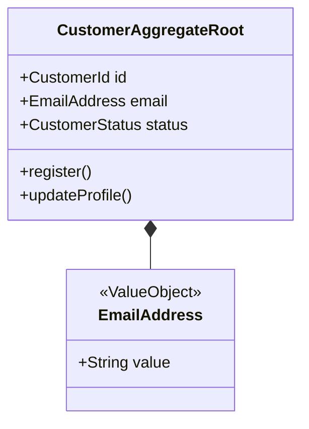
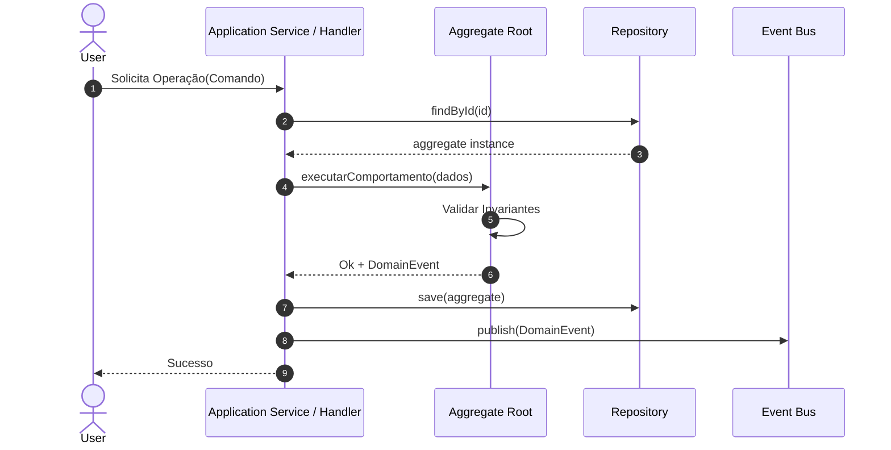

# Domain Design Specification: [Nome da Unit]

**Unit**: [UNIT-ID: Nome da Unit]  
**Paradigma**: Domain-Driven Design (DDD) - Modelagem Tática & Estratégica  
**Status**: [Draft / In Review / Validated]  

---

## 1. Visão Geral do Domínio & Linguagem Ubíqua (Ubiquitous Language)

| Termo do Domínio | Definição Semântica | Contexto de Uso |
|---|---|---|
| **[Termo 1]** | [Significado preciso segundo as regras de negócio] | [Onde se aplica] |
| **[Termo 2]** | [Significado preciso segundo as regras de negócio] | [Onde se aplica] |

---

## 2. Modelagem Tática DDD (Independente de Infraestrutura)

### 2.1 Agregados e Raízes de Agregado (Aggregates & Aggregate Roots)
- **Aggregate Root**: `[NomeDoAgregado]`
  - **Identificador Único**: `[AggregateId]`
  - **Invariantes e Regras de Consistência**:
    - *Regra 1*: [Condição que sempre deve ser verdadeira no aggregate]
    - *Regra 2*: [Validação interna antes de transições de estado]

### 2.2 Entidades (Entities)
- **`[NomeDaEntidade]`**:
  - **ID**: `[Tipo / UUID]`
  - **Atributos**:
    - `atributo_1`: `Tipo` (descrição)
    - `atributo_2`: `Tipo` (descrição)
  - **Comportamentos / Métodos de Negócio**:
    - `executarAcao(param)`: valida e altera estado.

### 2.3 Objetos de Valor (Value Objects - Imutáveis)
- **`[NomeDoValueObject]`**:
  - **Atributos imutáveis**: `[campoA, campoB]`
  - **Validações na instanciação**: [Verificações que garantem validade estrita]
  - **Exemplos**: `EmailAddress`, `Money`, `Currency`, `DateRange`

### 2.4 Eventos de Domínio (Domain Events)
- **`[NomeDoEventoDomain]`**:
  - **Quando é disparado**: [Ação que finalizou no aggregate]
  - **Payload**:
    - `eventId`: UUID
    - `occurredOn`: Timestamp
    - `aggregateId`: ID do aggregate
    - `details`: dados relevantes para consumidores downstream

### 2.5 Contratos de Repositório (Repository Interfaces)
- **`I[NomeDoAgregado]Repository`**:
  - `save(aggregate): Promise<void>`
  - `findById(id): Promise<Aggregate | null>`
  - `findByCriteria(criteria): Promise<Aggregate[]>`

### 2.6 Fábricas / Domain Services (Factories & Domain Services)
- Operações de domínio puras que cruzam múltiplos agregados ou instanciam estruturas complexas sem pertencer a uma única entidade.

---

## 3. Modelo Estático & Diagrama de Classes

---

## 4. Modelo Dinâmico (Fluxo de Interação de Casos de Uso Críticos)

---

## 5. Checkpoint de Validação do Desenvolvedor
- [ ] O modelo representa fielmente as regras de negócio sem misturar detalhes de banco de dados ou frameworks.
- [ ] As invariantes de consistência do aggregate estão bem delimitadas.
- [ ] Os eventos de domínio cobrem todos os efeitos colaterais esperados.
