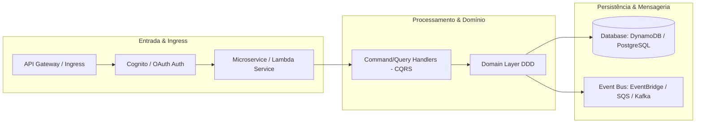

# Logical Design & Architecture Decision Record (ADR): [Nome da Unit]

**Unit**: [UNIT-ID: Nome da Unit]  
**Design Level**: Logical Architecture & Cloud Implementation  
**Status**: [Draft / In Review / Approved]  

---

## 1. Arquitetura Lógica e Mapeamento de Componentes

Mapeamento dos conceitos do Domain Design para componentes lógicos, padrões de arquitetura distribuída e serviços de nuvem (ex.: AWS, GCP, Azure).



---

## 2. Atendimento aos Requisitos Não-Funcionais (NFRs)

| Dimensão NFR | Meta / Especificação | Solução Arquitetural Aplicada | Padrão / Tecnologia |
|---|---|---|---|
| **Escalabilidade** | Picos de até 10.000 RPS | Auto-scaling horizontal / Funções Serverless sob demanda | Cloud Serverless / K8s HPA |
| **Resiliência** | Tolerância a falha em downstream | Circuit Breaker, Retry com Exponential Backoff e DLQ | Resilience4j / SQS DLQ |
| **Consistência** | Consistência eventual entre Units | Event-Driven Architecture / Saga Pattern | Outbox Pattern + Event Bus |
| **Segurança** | Criptografia end-to-end e least privilege | IAM Roles granulares, KMS, Validação de schema no Gateway | Cloud IAM + KMS |

---

## 3. Architecture Decision Records (ADRs)

### ADR-001: [Título da Decisão Arquitetural, ex.: Escolha de DynamoDB vs Aurora PostgreSQL]

#### Contexto e Declaração do Problema
*Explicação do problema técnico enfrentado, volumetria de dados, características de leitura/escrita e restrições de latência.*

#### Opções Consideradas
1. **Opção A**: [ex.: Amazon DynamoDB (NoSQL Chave-Valor com particionamento automático)]
2. **Opção B**: [ex.: Aurora PostgreSQL (SQL Relacional com replicação de leitura)]

#### Critérios de Avaliação & Trade-offs
| Critério | Opção A | Opção B |
|---|---|---|
| Latência P99 | < 10ms previsível em alta escala | 20-50ms dependendo de joins |
| Flexibilidade de Query | Baixa (apenas Partition Key e Sort Key) | Alta (joins complexos e consultas ad-hoc) |
| Custo Operacional | Totalmente gerenciado, pay-per-request | Instâncias provisionadas ou Aurora Serverless |

#### Decisão Aprovada
> **Decisão**: Foi escolhida a **Opção A (DynamoDB)** devido à exigência estrita de latência sub-10ms e acesso prioritariamente por chave composta (`CustomerId + Timestamp`).

#### Consequências & Mitigações
- **Consequência Positiva**: Latência previsível, sem necessidade de sharding manual.
- **Consequência Negativa**: Consultas agregadas e relatórios não podem ser feitos diretamente na tabela principal.
- **Mitigação**: Exportação contínua via DynamoDB Streams para Data Lake / S3 para consultas analíticas assíncronas.

---

## 4. Estrutura de Deployment Unit Proposta

```text
infrastructure/
├── terraform/ (ou cdk/)
│   ├── main.tf
│   ├── variables.tf
│   └── outputs.tf
src/
├── domain/             # Modelos puros DDD (sem dependência de framework)
├── application/        # Use cases, DTOs, Handlers
└── infrastructure/     # Adaptadores de banco, mensageria e controllers web
tests/
├── unit/               # Testes unitários de domínio e casos de uso
├── integration/        # Testes de integração com banco/filas em mock/testcontainers
└── performance/        # Cenários de teste de carga (k6, Locust)
```

---

## 5. Checkpoint de Aprovação da Arquitetura
- [ ] O arquiteto avaliou e aprovou os trade-offs descritos no ADR.
- [ ] O modelo lógico cumpre integralmente os NFRs e critérios de segurança.
- [ ] Os pontos de integração e contratos de eventos estão alinhados com os times parceiros.
