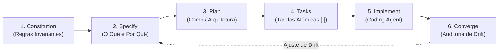

---
name: sdd
description: >-
  Metodologia Spec-Driven Development (SDD) da Microsoft (Apoorv Gupta / GitHub Spec Kit) para engenharia de software nativa de IA.
  Use esta skill para criar constituições de projeto (constitution.md), especificações funcionais ricas (spec.md), planos arquiteturais técnicos (plan.md),
  listas ordenadas de tarefas atômicas com checkboxes (tasks.md) para agentes de código, e relatórios de auditoria de convergência (converge.md) para eliminar o Spec Drift.
---

# Spec-Driven Development (SDD) - Microsoft Framework

Guia e procedimentos operacionais para condução do desenvolvimento orientado por especificações (Spec-Driven Development), fundamentado no trabalho de Apoorv Gupta (Principal Software Engineer, Microsoft) e no ecossistema GitHub Spec Kit.

---

## 1. O Princípio Central: Spec Quality = Output Quality

O SDD combate diretamente o problema do **"vibe coding"** (geração desestruturada de código por IA, que acumula débito técnico, alucinações de escopo e inconsistências arquiteturais).

- **A Especificação como SSOT**: A especificação escrita e versionada é a **Única Fonte da Verdade (Single Source of Truth - SSOT)**.
- **Cadeia de Contexto Determinística**: Agentes de codificação não devem adivinhar requisitos. Eles recebem uma cadeia de evidências estruturada que restringe o espaço de busca e elimina ambiguidades:
  `constitution.md` -> `spec.md` -> `plan.md` -> `tasks.md` -> `converge.md`.
- **Custo de Descoordenação**: O custo de retrabalho provocado por desalinhamentos entre desenvolvedor e IA é muito maior do que o custo de redigir especificações executáveis e rigorosas.

---

## 2. As Fases e Artefatos do SDD



### 2.1 Fase 1: Constitution (`constitution.md`)
- **Objetivo**: Estabelece os guardrails de engenharia invariantes do repositório.
- **Conteúdo**: Stack homologada, regras estritas de tipagem, proibição de credenciais em código, padrões de tratamento de erros, exigência de cobertura mínima de testes (ex.: 80%) e isolamento do domínio.

### 2.2 Fase 2: Specify (`spec.md`)
- **Objetivo**: Define o escopo funcional e técnico sem acoplamento prematuro a detalhes de infraestrutura.
- **Conteúdo**: O *quê* e o *porquê*, declaração do problema, personas, escopo positivo (*in-scope*), escopo explicitamente excluído (*non-goals*), cenários de uso (Happy Path e Edge Cases), modelagem semântica de entidades e critérios de aceitação verificáveis.

### 2.3 Fase 3: Plan (`plan.md`)
- **Objetivo**: Traduz a especificação em um plano técnico de arquitetura executável.
- **Conteúdo**: Diagramas de sequência Mermaid, contratos de interface e endpoints REST/gRPC (schemas JSON/OpenAPI), estrutura de diretórios e arquivos propostos, decisões de persistência e trade-offs técnicos.

### 2.4 Fase 4: Tasks (`tasks.md`)
- **Objetivo**: Decompõe o plano em tarefas pequenas, atômicas e sequencialmente ordenadas.
- **Conteúdo**: Lista com caixas de seleção `[ ]` organizada por blocos (Domínio -> Aplicação/DTOs -> Adaptadores de Infra -> Testes). Cada tarefa tem um arquivo alvo e um critério objetivo de conclusão para consumo determinístico por agentes de codificação.

### 2.5 Fase 5: Implement (Handoff para o Coding Agent)
- **Objetivo**: A fase de codificação propriamente dita, executada pelo agente de desenvolvimento (*Coding Agent*). O agente de código consome `constitution.md`, `spec.md`, `plan.md` e executa cada tarefa de `tasks.md`, marcando `[x]`.

### 2.6 Fase 6: Converge (`converge.md`)
- **Objetivo**: Auditoria de conformidade pós-implementação conduzida pelo arquiteto/planejador.
- **Conteúdo**: Matriz comparativa entre os requisitos da `spec.md` e o código real gerado, detecção de **Spec Drift** (over-engineering, código não solicitado ou requisitos esquecidos) e parecer formal de liberação.

---

## 3. Localização na Context Memory (`spec-docs/specs/`)

Os pacotes de especificação SDD são armazenados de forma modular:

```text
spec-docs/specs/
├── constitution.md             # Constituição global de engenharia do repositório
└── <unit_name>/
    ├── spec.md                 # Especificação funcional e técnica da Unit/Feature
    ├── plan.md                 # Plano arquitetural técnico e contratos de API
    ├── tasks.md                # Lista ordenada de tarefas atômicas com checkboxes [ ]
    └── converge.md             # Relatório de auditoria de conformidade e spec drift
```

---

## 4. Templates Disponíveis

Consulte os templates da pasta `references/templates/`:
- [`references/templates/constitution_template.md`](references/templates/constitution_template.md): Template de constituição de engenharia.
- [`references/templates/spec_template.md`](references/templates/spec_template.md): Template de especificação de feature.
- [`references/templates/plan_template.md`](references/templates/plan_template.md): Template de plano técnico de arquitetura.
- [`references/templates/tasks_template.md`](references/templates/tasks_template.md): Template de tarefas atômicas com checkboxes.
- [`references/templates/converge_template.md`](references/templates/converge_template.md): Template de auditoria de convergência e drift.
