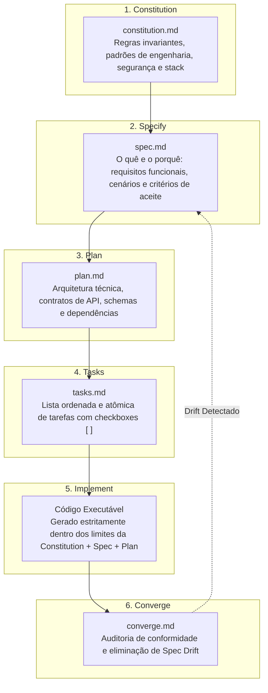

# Guia: Spec-Driven Development (SDD) para Engenharia Nativa de IA

Baseado no artigo da Microsoft (*Microsoft for Developers*):  
*Spec-Driven Development: A Spec-First Approach to AI-Native Engineering* por Apoorv Gupta (Principal Software Engineer, Microsoft).

---

## 1. O Problema Central: Da Ilusão do "Vibe Coding" à Precisão por Especificação

A introdução de LLMs acelerou dramaticamente a capacidade de gerar código. Contudo, essa aceleração gerou um paradoxo:
- **Velocidade sem Direção**: Gerar 1.000 linhas de código por minuto não tem valor se a lógica estiver desalinhada das intenções de negócio ou dos padrões de segurança.
- **O Princípio de Ouro**: **Spec Quality = Output Quality**. Conforme os agentes de IA se tornam mais rápidos, a especificação deixa de ser um mero documento burocrático e se torna o **gargalo e a principal alavanca de qualidade** do software.
- **Custo de Descoordenação**: O custo de retrabalho causado por desvios de entendimento entre a IA e o desenvolvedor supera em muito o custo de redigir especificações rigorosas e estruturadas.

O **Spec-Driven Development (SDD)** propõe que a especificação seja a **Única Fonte da Verdade (Single Source of Truth - SSOT)**, executável e versionada, guiando os agentes em cada etapa de implementação.

---

## 2. A Cadeia de Contexto e Fases do SDD

### 2.1 Fase 1: Constitution (`constitution.md`)
- Define as **regras do jogo** e princípios invariantes do repositório.
- Estabelece diretrizes de stack tecnológica, requisitos de segurança, padrões de nomenclatura, política de tratamento de erros e nível de cobertura de testes.
- Atua como o "guardrail" que todo agente deve obedecer antes de gerar qualquer código.

### 2.2 Fase 2: Specify (`spec.md`)
- Foca no **"O quê"** e no **"Por quê"**, sem prender-se precipitadamente a detalhes de implementação.
- Mapeia atores/personas, fluxos de usuário essenciais, cenários de sucesso e caminhos de exceção.
- Define critérios de aceitação mensuráveis e o escopo explícito fora do projeto (*Non-goals*).

### 2.3 Fase 3: Plan (`plan.md`)
- Traduz a especificação em um **plano arquitetural técnico rigoroso**.
- Define interfaces, contratos de API (schemas OpenAPI/JSON), diagramas de sequência de interação entre serviços, modelo de entidades e decisões técnicas fundamentadas.

### 2.4 Fase 4: Tasks (`tasks.md`)
- Decompõe o plano em **tarefas granulares, atômicas e sequenciais**.
- Cada tarefa deve ser pequena o suficiente para ser executada e verificada de forma determinística por um agente de IA.
- Utiliza caixas de seleção `[ ]` onde a conclusão de cada item avança o estado do projeto.

### 2.5 Fase 5: Implement
- A fase de codificação onde o agente lê a cadeia de artefatos (`constitution.md` + `spec.md` + `plan.md` + `tasks.md`) e gera os arquivos de código e testes correspondentes.

### 2.6 Fase 6: Converge (`converge.md`)
- O passo crítico de **verificação de alinhamento**.
- Compara o código final implementado com os requisitos originais da especificação para detectar e eliminar o **Spec Drift** (alucinações da IA, features não solicitadas ou requisitos esquecidos).

---

## 3. Simbiose: SDD (Microsoft) + AI-DLC (AWS)

A integração entre o **AI-DLC** e o **SDD** forma o ecossistema ideal para engenharia nativa de IA:

| Dimensão | AI-DLC (AWS / Raja SP) | SDD (Microsoft / Apoorv Gupta) | Abordagem Integrada do AI-DLC Specialist |
|---|---|---|---|
| **Estratégia de Domínio** | Domain-Driven Design (DDD), Units e Bounded Contexts | Specify & Plan | As Units do AI-DLC encapsulam os pacotes de especificação SDD (`spec.md`, `plan.md`). |
| **Iteração Rápida** | Bolts (horas/dias) em vez de Sprints | Tasks atômicas e ordenadas | Cada Bolt do AI-DLC consome um subconjunto ordenado de `tasks.md` do SDD. |
| **Loss Function Humana** | Aprovação iterativa em pontos críticos | Constitution & Converge | A `constitution.md` define as políticas e a fase de `converge.md` formaliza a auditoria da Loss Function. |
| **Context Memory** | `spec-docs/` centralizado | Arquivos Markdown versionados | Os artefatos SDD residem em `spec-docs/specs/<unit>/` com rastreabilidade total. |
