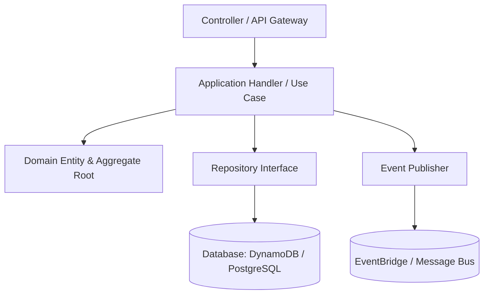
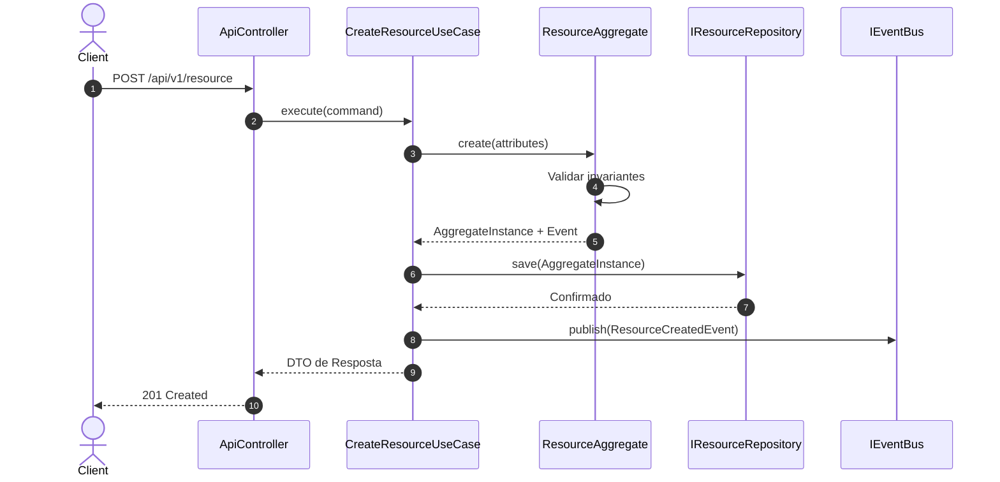

# Technical Architecture Plan: [Nome da Feature / Módulo]

**Referência da SPEC**: `spec-docs/specs/<unit>/spec.md`  
**Status**: [Draft / In Review / Approved]  
**Arquiteto**: [Tech Lead / AI-DLC Specialist]  
**Data**: [YYYY-MM-DD]  

---

## 1. Visão Geral da Arquitetura Técnica
Este plano define a estrutura técnica, interfaces, fluxo de dados e decisões de engenharia para implementar integralmente os requisitos estabelecidos na especificação.



---

## 2. Contratos de Interface e Endpoints (API Specs)

### 2.1 Endpoint: `POST /api/v1/resource`
- **Descrição**: Criação e processamento da entidade de domínio.
- **Autenticação**: Bearer JWT (Role: `User` ou `Admin`).
- **Headers Requeridos**:
  - `Content-Type`: `application/json`
  - `X-Correlation-Id`: `string (UUID)`
- **Códigos de Resposta**:
  - `201 Created`: Recurso criado com sucesso.
  - `400 Bad Request`: Falha de validação no payload.
  - `409 Conflict`: Violação de chave única ou conflito de concorrência.
  - `500 Internal Server Error`: Falha inesperada.

---

## 3. Diagrama de Sequência Técnico


---

## 4. Estrutura de Arquivos e Componentes no Projeto
```text
src/
├── domain/
│   ├── entities/
│   │   └── Resource.ts
│   ├── values/
│   │   └── ResourceStatus.ts
│   └── events/
│       └── ResourceCreatedEvent.ts
├── application/
│   ├── use-cases/
│   │   └── CreateResourceUseCase.ts
│   └── dtos/
│       ├── CreateResourceRequest.ts
│       └── CreateResourceResponse.ts
└── infrastructure/
    ├── controllers/
    │   └── ResourceController.ts
    └── repositories/
        └── PostgresResourceRepository.ts
```

---

## 5. Trade-offs e Decisões de Arquitetura
- **Persistência**: Optou-se por PostgreSQL com transação ACID estrita para garantir consistência financeira imediata.
- **Mensageria**: EventBridge com padrão Outbox para garantir que nenhum evento seja perdido em caso de queda de conexão.
